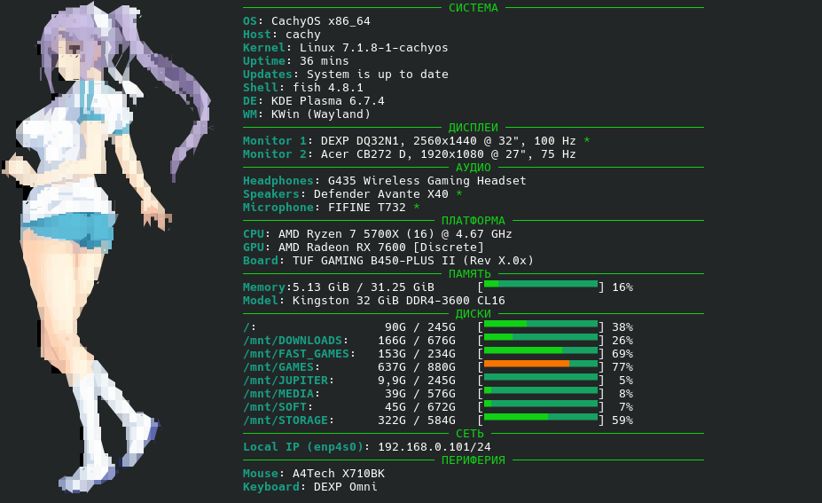

# cachy-config

Персональные конфигурации для CachyOS.

## FastFetch


Текущая версия конфигурации: **beta 4.0**

Конфигурация FastFetch разделена на несколько частей:

- `fastfetch/config.jsonc` — основная конфигурация, оформление и логика вывода.
- `fastfetch/devices.conf` — названия и идентификаторы оборудования.
- `fastfetch/memory-usage.sh` — отображение использования оперативной памяти.
- `fastfetch/usage.sh` — отображение использования дисков и других динамических показателей.

### Аппаратная конфигурация

Названия и идентификаторы устройств вынесены в `devices.conf`.

При замене оборудования достаточно изменить значения в этом файле. Логику `config.jsonc` менять не требуется.

В `devices.conf` хранятся:

- мониторы и их видеовыходы;
- мышь и клавиатура;
- наушники, колонки и микрофон;
- модель установленной оперативной памяти.

Динамические показатели системы в этот файл не входят.

### Установка FastFetch

Скопировать содержимое каталога `fastfetch` в:

```bash
mkdir -p ~/.config/fastfetch
cp -r fastfetch/* ~/.config/fastfetch/
```


После этого FastFetch будет использовать `config.jsonc` и автоматически подключать `devices.conf`.

## Git

Основная ветка:

    main

Для отправки изменений в GitHub:

    git add .
    git commit -m "Описание изменений"
    git push
